# Roadmap — v0.1.21 → v0.4.x

**Status:** dependency waterfall. Positions in the Gantt below
indicate **sequence**, not delivery dates. Each milestone ships
when its dependencies are green; phases are gated by their
predecessor, work within a phase parallelizes where shown.

Companion docs:
- [`docs/V0.2.0_VERIFY_SUBSUMPTION.md`](./V0.2.0_VERIFY_SUBSUMPTION.md) — v0.2.0 implementation plan
- [`docs/FEDERATION_DIRECTORY.md`](./FEDERATION_DIRECTORY.md) — v0.3.0+ federation directory contract
- [`docs/COHABITATION.md`](./COHABITATION.md) — v0.1.14+ runtime keyring authority (foundation; v0.2.0 builds on it)

---

## Unified dependency graph

```mermaid
gantt
    title CIRIS Persist roadmap — dependencies, not timelines
    dateFormat X
    axisFormat %s

    section v0.1.21 — SQLite Backend Phase 1 parity
    Translate migrations/sqlite/lens/V001 + V003 (postgres → sqlite)  :v121a, 0, 1
    SqliteBackend skeleton (rusqlite + spawn_blocking adapter)        :v121b, after v121a, 1
    insert_trace_events_batch (ON CONFLICT DO NOTHING)                :v121c1, after v121b, 1
    insert_trace_llm_calls_batch                                      :v121c2, after v121b, 1
    lookup_public_key + sample_public_keys                            :v121c3, after v121b, 1
    run_migrations (refinery sqlite)                                  :v121c4, after v121b, 1
    Mirror postgres test suite against SqliteBackend                  :v121d, after v121c1 v121c2 v121c3 v121c4, 1
    Cargo.toml feature wiring + store/mod.rs export                   :v121e, after v121d, 1
    CHANGELOG + v0.1.21 release                                       :v121f, after v121e, 1

    section v0.2.0 — Verify Subsumption (CIRISPersist#4)
    Pin bump ciris-verify-core 1.8.0 → 1.8.4              :v20a, after v121f, 1
    Existing test suite green vs new pin                  :v20b, after v20a, 1
    Cryptographic proxies (sign / public_key / attest)    :v20c1, after v20b, 1
    License + integrity proxies                           :v20c2, after v20b, 1
    Build-manifest proxies                                :v20c3, after v20b, 1
    Hybrid-signing proxy                                  :v20c4, after v20b, 1
    PyO3 wheel smoke tests                                :v20d, after v20c1 v20c2 v20c3 v20c4, 1
    Lens integration tests                                :v20e, after v20d, 1
    CHANGELOG + v0.2.0 release                            :v20f, after v20e, 1

    section v0.3.0 — Federation Directory (schema + trait)
    federation_keys schema + migration SQL                :v30a, after v20f, 1
    FederationDirectory trait + types                     :v30b, after v20f, 1
    Backend (postgres) implementation                     :v30c, after v30a v30b, 1
    Write-authority guards (rate limit + per-primitive quota)  :v30d, after v30c, 1
    Bootstrap migration (persist-steward self-signed row) :v30e, after v30c, 1
    verify_build_manifest implicit-pubkey lookup overload :v30f, after v30c, 1
    Tests (smoke + bootstrap parity + write-authority)    :v30g, after v30d v30e v30f, 1
    CHANGELOG + v0.3.0 release                            :v30h, after v30g, 1

    section v0.3.x — Federation surface completion
    federation_attestations schema + trait                :v3xa, after v30h, 1
    federation_revocations schema + trait                 :v3xb, after v30h, 1
    Bilateral divergence telemetry                        :v3xc, after v30h, 1
    Registry dual-write integration                       :v3xd, after v3xa v3xb v3xc, 1
    Production-traffic schema soak                        :v3xe, after v3xd, 1

    section v0.4.0 — Read-path migration
    Switch lookup_public_key → federation_keys            :v40a, after v3xe, 1
    Backfill validation (parity counter)                  :v40b, after v40a, 1
    Experimental schema contract retires                  :v40c, after v40b, 1
    CHANGELOG + v0.4.0 release                            :v40d, after v40c, 1

    section v0.4.x — Deprecation + polish (parallelizable)
    accord_public_keys → read-only view                   :v4xa, after v40d, 1
    PG NOTIFY pubsub (cache coherence)                    :v4xb, after v40d, 1
    Trust-contract diff lands (registry side)             :v4xc, after v40d, 1
```



---

## Phase-by-phase waterfall

### v0.1.21 — SQLite Backend Phase 1 parity

**Gates next phase on:** SQLite is a declared-but-stubbed
feature today (rusqlite pinned since v0.1.9, sqlite feature
flag declared, empty `migrations/sqlite/`). v0.1.21 makes it
real — sovereign-mode (single-node, no Postgres) and Pi-class
deployments per FSD §7 #7 become viable. Lens team requested
parity before v0.2.0.

**Sequential dependencies:**

```
v121a (migrations translated)
  → v121b (SqliteBackend skeleton with rusqlite + spawn_blocking)
  → [v121c1 ║ v121c2 ║ v121c3 ║ v121c4]   (parallel: independent
                                            trait methods)
  → v121d (test parity vs postgres)
  → v121e (Cargo wiring + export)
  → v121f (release)
```

**Parallelizable inside the phase:** the four trait methods
(`v121c1`–`v121c4`) — independent, share only the connection
pool. Memory backend's parity test suite is the spec; SQLite
must produce identical insert / lookup / sample results given
identical inputs.

**Schema translation gotchas (V001):**

- `BIGSERIAL` → `INTEGER PRIMARY KEY AUTOINCREMENT` (single-col
  PK; postgres' composite PK on `(event_id, ts)` collapses to
  `event_id` since SQLite uses rowid for ordering)
- `TIMESTAMPTZ` → `TEXT` (ISO-8601 with timezone — wire-format
  preservation matters per v0.1.8's WireDateTime doctrine)
- `JSONB` → `TEXT` (SQLite has json1 extension for queries; we
  store payload verbatim either way)
- `BOOLEAN` → `INTEGER` (0/1; SQLite has no native bool)
- `DOUBLE PRECISION` / `NUMERIC(10,6)` → `REAL`
- `CREATE SCHEMA cirislens` + `cirislens.table` → drop schema
  prefix; SQLite has no schemas
- `IS DISTINCT FROM` → `IS NOT`
- TimescaleDB hypertable creation → skip entirely
- `DEFAULT NOW()` → `DEFAULT CURRENT_TIMESTAMP`

---

### v0.2.0 — Verify Subsumption

**Gates next phase on:** `Engine` exposes verify-shaped proxy
methods so v0.3.0 can extend `verify_build_manifest` with
implicit federation-directory lookup without consumers
re-plumbing.

**Sequential dependencies:**

```
v20a (pin bump) → v20b (test green vs new pin)
  → [v20c1 ║ v20c2 ║ v20c3 ║ v20c4]   (parallel proxy method groups)
  → v20d (smoke tests)
  → v20e (lens integration)
  → v20f (release)
```

**Parallelizable inside the phase:** the four proxy method
groups (`v20c1`–`v20c4`) — independent `Engine` methods, no
shared state on the persist side, separate test surfaces.

---

### v0.3.0 — Federation Directory schema + trait

**Gates next phase on:** `federation_keys` schema is in
production with bootstrap row + write-authority guards;
`verify_build_manifest` (from v0.2.0) now has the option of
looking up `trusted_pubkey` against `federation_keys` instead
of taking it as a caller arg.

**Sequential dependencies:**

```
v20f (v0.2.0 ships)
  → [v30a (schema) ║ v30b (trait def)]   (independent — schema is SQL,
                                          trait is Rust types)
  → v30c (Backend postgres impl)         (needs both schema and trait)
  → [v30d (rate limit + quota) ║
     v30e (bootstrap migration) ║
     v30f (verify_build_manifest overload)]   (parallel: independent surfaces
                                                on top of Backend)
  → v30g (tests)
  → v30h (release)
```

**Parallelizable inside the phase:**
- `v30a` (schema SQL) and `v30b` (trait + types) — independent.
- `v30d`, `v30e`, `v30f` — all build on Backend, no inter-dependencies.

---

### v0.3.x — Federation surface completion

**Gates next phase on:** full read+write surface of the
federation directory has been exercised against real production
attestation patterns from registry's dual-write deployment;
divergence telemetry has been quiet long enough to retire the
experimental schema contract.

**Sequential dependencies:**

```
v30h (v0.3.0 ships)
  → [v3xa (attestations) ║
     v3xb (revocations) ║
     v3xc (divergence telemetry)]   (parallel — three independent extensions)
  → v3xd (registry dual-write integration)   (needs the full surface)
  → v3xe (production-traffic schema soak)
```

**Parallelizable inside the phase:** `v3xa`, `v3xb`, `v3xc` —
independent schemas/instrumentation on top of v0.3.0's Backend.

**Cross-team gate:** `v3xd` requires registry's
`FEDERATION_DUAL_WRITE_ENABLED` deployment. Registry decides
their version cadence on their own side; persist doesn't block
on a specific registry version, just on the dual-write hop being
live somewhere.

---

### v0.4.0 — Read-path migration

**Gates next phase on:** `lookup_public_key` reads from
`federation_keys` first, with full backfill from
`accord_public_keys`. Schema becomes stable (v0.3.x experimental
contract retires); breaking changes from v0.4.0+ follow standard
semver-major rules.

**Sequential dependencies:**

```
v3xe (schema soak green)
  → v40a (switch lookup_public_key)
  → v40b (parity-counter validation)
  → v40c (retire experimental contract)
  → v40d (release)
```

**Parallelizable inside the phase:** none — the read-path flip
is a single ordered handoff.

---

### v0.4.x — Deprecation + polish

**Gates next phase on:** N/A (terminal phase for the federation
directory work). v0.5.0+ scope is determined by what consumers
need next.

**Sequential dependencies:**

```
v40d (v0.4.0 ships)
  → [v4xa (accord_public_keys deprecated to view) ║
     v4xb (PG NOTIFY pubsub) ║
     v4xc (trust-contract diff on registry side)]
```

**Parallelizable inside the phase:** all three — independent
deliverables. `v4xc` is registry-side work; persist contributes
review only.

---

## Critical path

The strict dependency chain — where any delay propagates to the
final milestone:

```
v121a → v121b → v121c* → v121d → v121e → v121f
  → v20a → v20b → v20c* → v20d → v20e → v20f
  → v30a/b → v30c → v30d/e/f → v30g → v30h
  → v3xa/b/c → v3xd → v3xe
  → v40a → v40b → v40c → v40d
  → v4xa/b/c (terminal)
```

Items separated by `║` in the phase waterfalls above are *off
the critical path within their phase* — they can slip without
extending the phase, as long as their phase's join point
(`v20d`, `v30g`, `v3xd`, etc.) starts when its predecessors are
all green.

---

## What this roadmap does NOT promise

- **No delivery dates.** Phase ordering is gated by code being
  green and consumers being ready, not by calendar.
- **No work-effort estimates.** Different items in the same
  phase have different scope; the roadmap is for sequencing, not
  capacity planning.
- **No promise that every v0.3.x item ships in a single release.**
  v0.3.x is a series of patch releases; attestations might land
  in v0.3.1, revocations in v0.3.2, etc. The phase ends when
  v3xe (production soak) is green, which gates the v0.4.0 cut.
- **No promise about post-v0.4.x scope.** This roadmap is
  bounded by the federation-directory work. v0.5.0+ is open.
