# v0.2.0 — Verify Subsumption

**Status:** planning. Implements [`CIRISPersist#4`](https://github.com/CIRISAI/CIRISPersist/issues/4).
Companion to `docs/COHABITATION.md` (cohabitation doctrine —
persist as runtime keyring authority) and `docs/FEDERATION_DIRECTORY.md`
(v0.3.0+ federation directory; this milestone is the prerequisite).

---

## TL;DR

Three things ship in v0.2.0:

1. **`Engine` grows verify-shaped proxy methods.** Persist's
   `Engine` already holds the verify Engine (v0.1.14+
   flock-bootstrap + transparency log); v0.2.0 exposes
   verify-shaped operations on persist's Python API so
   higher layers don't have to instantiate their own verify
   Engine.
2. **Higher layers drop direct `ciris-verify` imports.** Lens,
   agent, and bridge migrate to `import ciris_persist` and
   call persist's surfaces. CIRISVerify v1.8.4's "if persist is
   in your stack, persist is the interface" claim becomes
   load-bearing instead of aspirational.
3. **`verify_build_manifest` keeps `trusted_pubkey` as a caller
   arg in v0.2.0.** Bootstrap by passing the steward pubkey
   explicitly (same as today). v0.3.0's federation directory
   (`docs/FEDERATION_DIRECTORY.md`) replaces this with a
   no-arg lookup against `federation_keys`. v0.2.0 keeps the
   contract simple; v0.3.0 makes it ergonomic.

---

## Why verify subsumption first

`docs/FEDERATION_DIRECTORY.md` v0.3.0 ships `federation_keys` +
`FederationDirectory` trait. The federation directory's primary
*read* consumer is `verify_build_manifest`, which looks up the
trusted pubkey for a given primitive. If verify subsumption ships
*after* the directory, every consumer (lens, agent, bridge) ends
up wiring its own
`verify.verify_build_manifest(bytes, primitive, persist.lookup_pubkey(primitive))`
plumbing. Sequence-correctness:

1. **v0.2.0** — persist exposes `Engine.verify_build_manifest(bytes,
   primitive, trusted_pubkey)` as a proxy. Caller still provides
   the pubkey explicitly. **One import for higher layers.**
2. **v0.3.0** — persist's `verify_build_manifest` overload drops
   the `trusted_pubkey` argument and consults `federation_keys`
   internally. **Higher layers don't change.**

If we ship federation directory first, every consumer rewrites
twice (first to plumb the pubkey lookup, then to drop it). Verify
subsumption first means consumers migrate once.

---

## Surfaces shipping in v0.2.0

All proxy to the held verify Engine. Persist adds policy hooks
(rate-limiting, logging, scoping) at the proxy boundary as
needed.

### Cryptographic operations

```python
class Engine:
    def sign(self, data: bytes) -> bytes: ...
    def public_key(self) -> bytes: ...
    def attestation_export(self, challenge: bytes) -> AttestationProof: ...
    def storage_descriptor(self) -> StorageDescriptor: ...
```

`sign` / `public_key` / `attestation_export` are the agent's hot
path — every signed event goes through them. `storage_descriptor`
exposes the keyring's storage class (file, TPM, HSM, etc.) for
threat-model consumers.

### License + integrity

```python
class Engine:
    def get_license_status(self, challenge: bytes) -> LicenseStatusResponse: ...
    def check_capability(self, capability: str, action: str, tier: int) -> bool: ...
    def check_agent_integrity(self, manifest: bytes, agent_root: str) -> FileIntegrityResult: ...
```

Today's CIRISVerify use case. Lens calls `get_license_status` on
agent registration; agent calls `check_capability` per request;
both call `check_agent_integrity` for tamper detection. After
v0.2.0 they all go through persist.

### Build manifest (federation substrate)

```python
class Engine:
    def verify_build_manifest(
        self,
        bytes: bytes,
        primitive: BuildPrimitive,
        trusted_pubkey: StewardPublicKey,  # v0.2.0; dropped in v0.3.0
    ) -> BuildManifest: ...
    def get_signed_function_manifest(
        self, project: str, version: str, target: str
    ) -> FunctionManifest: ...
```

`verify_build_manifest` is what consumes `ciris-build-sign` output
(CIRISVerify v1.8.0 substrate). v0.2.0 keeps `trusted_pubkey` as
caller-provided — the v0.3.0 federation directory makes it
implicit.

### Hybrid signing for build-manifest publishing

```python
class Engine:
    def hybrid_sign_build_manifest(
        self, manifest_bytes: bytes
    ) -> ManifestSignature: ...
```

Used by primitive CIs that publish their own build manifests
(persist's CI uses this today via `ciris-build-sign`; v0.2.0
exposes the same operation through persist's API for consistency).

---

## Design decisions

| Question | Decision | Rationale |
|---|---|---|
| Class shape | Methods on existing `Engine` (issue #4 option a) | Ergonomics. `Engine.sign(data)` is the natural call site; a sibling `Engine.verify` accessor adds an indirection layer for no payoff. |
| Lifecycle | Verify Engine constructed in `Engine.__init__`, lives for persist Engine lifetime | Matches verify's API expectation (long-lived Engine handle). No special teardown beyond persist's existing flock-protected shutdown. |
| Error surface | Pass through verify exceptions verbatim | Backwards compat with anyone migrating from direct `ciris-verify` imports. `from ciris_verify.exceptions import VerificationFailedError` still catches the right errors when raised by `Engine.verify_build_manifest`. |
| API stability | Pin `ciris-verify-core` per persist minor version; document the pin in CHANGELOG | Persist v0.1.15 already pins to v1.8.0. v0.2.0 bumps to v1.8.4 (the version that documents the cohabitation contract). v0.3.0 may bump again. Each persist minor names its verify pin. |
| `trusted_pubkey` bootstrap | v0.2.0 caller-provides; v0.3.0 federation-directory lookup | Sequencing — see §"Why verify subsumption first". |

---

## What this unlocks

| Consumer | Before v0.2.0 | After v0.2.0 |
|---|---|---|
| **CIRISLens** | `import ciris_verify; verify_engine = Engine(...)` separate from `import ciris_persist; persist_engine = Engine(...)` — two engines, two lifecycles, two threading models | `import ciris_persist` only; `persist_engine.sign(...)`, `persist_engine.verify_build_manifest(...)` |
| **CIRISAgent** | Direct `ciris-verify` import for sign/attest, plus `ciris-persist` for journal — inconsistent surface across hot path | One import chain: agent → persist → (verify, keyring, crypto). Threading concerns vanish (persist is the singleton). |
| **CIRISBridge** | Imports both crates; bridge logic deals with cross-engine coordination on diagnostic captures | Imports persist; uses `persist.debug_canonicalize` (already shipped v0.1.18) + `persist.verify_build_manifest` (new v0.2.0). One handle. |
| **Post-§3.1 collapsed stack** | Future-state — agent + lens merge | One binary, one persist Engine, one verify Engine inside it. The collapse is structurally correct because verify subsumption removed the "two engines" pattern. |

CIRISVerify-side **AV-14 closure**: CIRISVerify's
`THREAT_MODEL.md` §3.7 documents AV-14 ("verify Engine
multiplicity in persist-bearing stacks") as conditional on
persist actually being the interface. v0.2.0 makes that claim
load-bearing — multiplicity in persist-bearing stacks
disappears by construction.

---

## What this does NOT change

- **Verify-only deployments stay valid.** CIRISRegistry uses verify
  directly (single Rust binary, no Python persistence layer);
  sovereign-mode dev; CLI tooling. Verify is still a public
  library; persist isn't required.
- **Verify's public API stays unchanged.** Anyone importing
  `ciris-verify` directly continues to work. We're not gating; we're
  just making persist the natural wrapper when present.
- **No verify-side enforcement.** No runtime check refuses
  non-persist callers. Verify just does what it does.
- **`docs/COHABITATION.md` framing stays.** v0.1.14's
  flock-bootstrap is still how persist holds the keyring; v0.2.0
  just exposes more of what persist already holds.

---

## Implementation sketch

The proxy implementation is mechanical:

```python
# ciris_persist/_engine.py (or wherever Engine lives)

class Engine:
    def __init__(self, ...):
        # ... existing v0.1.x init ...
        self._verify = self._construct_verify_engine()  # held since v0.1.14

    # ===== v0.2.0 verify-shaped surfaces =====

    def sign(self, data: bytes) -> bytes:
        return self._verify.sign(data)

    def public_key(self) -> bytes:
        return self._verify.public_key()

    def attestation_export(self, challenge: bytes) -> AttestationProof:
        return self._verify.attestation_export(challenge)

    # ... (same shape for every method in §"Surfaces shipping") ...

    def verify_build_manifest(
        self,
        bytes: bytes,
        primitive: BuildPrimitive,
        trusted_pubkey: StewardPublicKey,
    ) -> BuildManifest:
        return self._verify.verify_build_manifest(bytes, primitive, trusted_pubkey)
```

Each method one-line-delegates. Persist may grow policy hooks at
the boundary (rate limit, audit log) before/after the delegation —
none required for v0.2.0 to ship.

---

## Tests

| Test category | Scope |
|---|---|
| Smoke (PyO3 wheel) | Each proxy method has an end-to-end "import persist, call method, check return shape" test. Goal: catch ABI / signature drift between `ciris-verify-core` versions. |
| Backwards compat | Import path `ciris_verify.exceptions.VerificationFailedError` still raises from `Engine.verify_build_manifest` on bad input. |
| Lifecycle | `Engine.__init__` constructs verify Engine; `Engine.__del__` (or context-manager exit) doesn't double-free. Verified against the existing flock-bootstrap test suite. |
| Error pass-through | Each verify exception raises through persist's proxy unchanged (type, message, traceback). |
| Threading | Persist Engine in a multi-threaded process: every thread sees the same verify Engine instance (per cohabitation doctrine). |
| Integration with existing v0.1.x surfaces | `Engine.process_envelope` (existing) + `Engine.verify_build_manifest` (new) work in the same Engine instance without conflict. |

---

## Work breakdown — dependencies, no timeline

```mermaid
gantt
    title v0.2.0 — Verify Subsumption (positions are dependency sequence, not delivery dates)
    dateFormat X
    axisFormat %s

    section Setup
    Pin bump ciris-verify-core 1.8.0 → 1.8.4    :v20a, 0, 1
    Existing test suite green vs new pin        :v20b, after v20a, 1

    section Proxy methods (parallelizable)
    Cryptographic proxies (sign / public_key / attestation_export / storage_descriptor)  :v20c1, after v20b, 1
    License + integrity proxies (get_license_status / check_capability / check_agent_integrity)  :v20c2, after v20b, 1
    Build-manifest proxies (verify_build_manifest / get_signed_function_manifest)  :v20c3, after v20b, 1
    Hybrid-signing proxy (hybrid_sign_build_manifest)  :v20c4, after v20b, 1

    section Validation + release
    PyO3 wheel smoke tests                      :v20d, after v20c1 v20c2 v20c3 v20c4, 1
    Lens integration tests                      :v20e, after v20d, 1
    CHANGELOG + v0.2.0 release                  :v20f, after v20e, 1
```



Dependency rules (waterfall):

- **`v20a` → `v20b`** — pin bump must succeed before testing against it.
- **`v20b` → all of `v20c*`** — proxy implementations build against the new verify pin; the four method groups are independent and parallelize freely (different `Engine` methods, separate test surfaces).
- **all of `v20c*` → `v20d`** — smoke tests assert every proxy method round-trips through the PyO3 boundary; need every method present.
- **`v20d` → `v20e`** — lens integration is the first real consumer; smoke must be green so a lens-side failure points at integration, not at persist.
- **`v20e` → `v20f`** — release after the consumer migration is validated.

v0.2.0 is intentionally a small surface: one import shift, no
schema changes, no migration. The federation directory work
(v0.3.0) is the architecturally ambitious milestone; v0.2.0 is
the prerequisite that makes v0.3.0 ergonomic. See
[`docs/ROADMAP.md`](./ROADMAP.md) for the full v0.2.0 → v0.4.x
dependency graph.

---

## What's NOT in v0.2.0

- **Federation directory schema.** Pushed to v0.3.0 (see
  `docs/FEDERATION_DIRECTORY.md`). v0.2.0's
  `verify_build_manifest` keeps the caller-provided
  `trusted_pubkey` arg.
- **Trust policy.** Persist remains policy-agnostic. v0.2.0 is a
  proxy layer; trust decisions stay in the consumer.
- **Auth surface for the proxy methods.** Verify's existing auth
  model (whoever has the key signs) stays. No new persist-side
  auth gate — that conversation belongs at v0.3.0+ if it
  surfaces at all.
- **Rust API mirror.** v0.2.0 is Python-side only (the PyO3
  wheel surface). The Rust crate doesn't need a verify proxy —
  Rust callers can import `ciris-verify-core` directly. If a
  use case for Rust-side proxy emerges later, v0.2.x can absorb.
